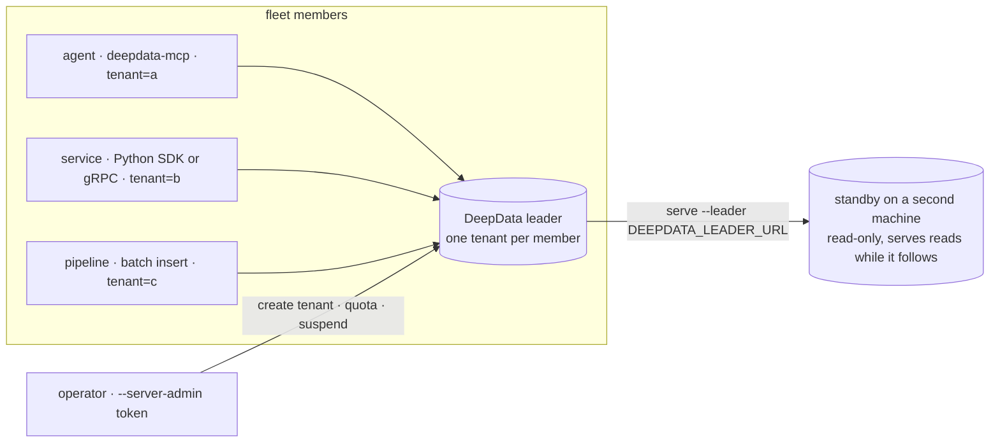

# DeepData

Tenant-aware vector search server in Go: one persistent, headless Linux binary that keeps every tenant in its own
durable store, scopes each call by JWT, enforces per-tenant quotas, and answers over an HTTP V3 contract and a matching
unary gRPC service. Callers send vectors, or texts embedded server-side when `DEEPDATA_EMBEDDER` names an embedder.
Version `0.2.0-rc.1` (`internal/releaseinfo/version.txt`, checked against Python, Helm and image metadata by
`scripts/check_version_contract.py` in CI). Gate status: [docs/PRE_RELEASE_STATUS.md](docs/PRE_RELEASE_STATUS.md),
rendered from `tasks/gates.json` by `scripts/gates.py`. Map: [docs/ARCHITECTURE.md](docs/ARCHITECTURE.md).

## What it does

```text
deepdata (one static binary)
├── serve             HTTP :8080 + gRPC :50051; DEEPDATA_BIND_HOST=127.0.0.1 for loopback only; JSON logs; /healthz /livez /readyz /metrics
├── token             mint a scoped JWT: --tenant, --permissions read,write,admin, --collections, --ttl, --server-admin
├── replicate         follow a leader's per-tenant journal into a standby directory (experimental, see "What it does not do")
├── migrate-tenants   move a pre-0.2 single-store data directory to per-tenant stores; verified, old files left in place
└── routes            print the contract table (16 operations; HTTP and gRPC names are identical)

deepdata-mcp          stdio MCP server, one tenant per process, six memory verbs:
                      remember · recall · forget · get · collections · create_collection
```

| Layer | What you get |
|---|---|
| Tenants | A first-class lifecycle: create, list, inspect, suspend, set quota, delete (`/v3/tenants`, server-administrator only). Each tenant is its own store under `<data-dir>/index.gob.tenants` with its own journal, lifetime lock, snapshot and usage counters. A tenant whose files are unreadable answers 503 by itself while every other tenant keeps serving; `/readyz` names it under `faulted_tenants`. |
| Isolation | A JWT carries the tenant, the permissions `read`/`write`/`admin` and an optional collection allowlist; a token minted for one tenant is refused on every other. Only the static `API_TOKEN` or a JWT carrying the `server_admin` claim can see or change the tenant list. |
| Quotas | Per-tenant caps on documents, bytes and collections: server defaults from `MAX_TENANT_DOCUMENTS`, `MAX_TENANT_BYTES` and `MAX_TENANT_COLLECTIONS`, overridable per tenant. Over the cap is 409 `quota_exceeded`; a suspended tenant is 403 on every data call. |
| Storage | Journal plus snapshot per tenant, fsync per acknowledged mutation, restart replays and reclaims. Dense fields index with `hnsw` or `flat`, sparse fields with `inverted` (BM25); cosine or euclidean distance. |
| Search | Several query fields per request, hybrid fusion of two fields (weighted or RRF), a primary-then-secondary fallback ladder, metadata filters with `$and`/`$or`/`$not` plus `$geo_radius` and `$geo_bbox`, `score_floor` with `weak_match` reporting, and `usage_boost` that favours documents recalled before. |
| Embedding | `DEEPDATA_EMBEDDER` is `none`, `ollama`, `openai`, `onnx` (build tag) or `hash` (deterministic, for tests). Text arrives as `texts`, is embedded on the fields bound to that embedder, and the MCP `memory` preset reads the embedder from `/readyz`, so an agent never names a model. |
| Standby | `deepdata serve` with `DEEPDATA_LEADER_URL` set follows every tenant the leader lists, in-process, over HTTP with the node credential, and serves reads the whole time it follows: `read_only: true`, a write is 403 with a hint naming the leader, and `/readyz` carries a `following` block per tenant (`state`, `applied_lsn`, `leader_lsn`, `lag`). It bootstraps tenants that appear later and reconnects after a dropped stream. `deepdata replicate --leader URL` remains the sync-only mode -- it never serves. Experimental: switched on only by `DEEPDATA_REPLICATION_TOKEN`, not covered by an RC gate. |
| Ops | Per-tenant metrics (`vectordb_tenant_requests_total`, `vectordb_tenant_request_duration_seconds`, `vectordb_tenant_documents`, `vectordb_tenant_bytes`), per-tenant rate limits (`TENANT_RPS`, `TENANT_BURST`), body, batch and dimension limits, a Dockerfile, Compose file and Helm chart under `deploy/helm`, and a Python SDK with sync and async clients, typed models and retries. |

## Shape for a fleet of agents



- One server, one tenant per member: a token per member from `deepdata token`, a quota per member. A runaway member
  fills its own quota, not everyone's, and suspending it is one PUT.
- Agents get memory verbs, not a database API: point `deepdata-mcp` at the member's tenant and the agent has
  remember, recall and forget with hybrid text search and filters.
- A member's token cannot see or touch another tenant; only the server-administrator credential manages the list.
- Each tenant is a fixed set of files under one prefix, so backup and copy are per member, not all or nothing.

Wiring a member is three lines:

```bash
export JWT_SECRET='the-secret-the-server-runs-with'
deepdata token --tenant hermes --permissions read,write --ttl 720h > hermes.jwt
DEEPDATA_URL=http://leader.internal:8080 DEEPDATA_TENANT=hermes DEEPDATA_API_KEY="$(cat hermes.jwt)" ./deepdata-mcp
```

## Connect an agent (MCP)

`cmd/deepdata-mcp` is a stdio MCP server that forwards tool calls to a running DeepData server over the HTTP
contract. It exposes six memory verbs — `deepdata_recall`, `deepdata_remember`, `deepdata_forget`, `deepdata_get`,
`deepdata_collections`, `deepdata_create_collection` — whose `inputSchema`/`outputSchema` are the JSON Schema files under
`api/contract/v3/schemas/` verbatim, and two resources, `deepdata://contract` (the agent contract, `api/contract/v3/CONTRACT.md`)
and `deepdata://status` (the server's `/readyz`). An agent speaks text: `deepdata_recall` and `deepdata_remember` embed it on
every field of the collection that binds an embedding, and the `memory` preset of `deepdata_create_collection` builds such a
collection from the server's own embedder. It is configured by `DEEPDATA_URL`, `DEEPDATA_TENANT`, `DEEPDATA_COLLECTION` and
`DEEPDATA_API_KEY` (`cmd/deepdata-mcp/main.go:213-216`); the tenant is never a tool argument. Build, Claude Desktop
configuration, per-verb arguments and the error shape: [docs/mcp.md](docs/mcp.md).

## Contract in one screen

<!-- generated:grpc-rpcs -->
`deepdata.v3.DeepData` exposes 15 unary RPCs: `GetTenantInfo`, `CreateTenant`, `ListTenants`, `UpdateTenant`, `DeleteTenant`, `ListCollections`, `GetCollection`, `CreateCollection`, `DeleteCollection`, `Insert`, `BatchInsert`, `Search`, `DeleteDoc`, `Upsert`, `GetDoc`.
<!-- /generated -->

Nine of them are mutations (`CreateCollection`, `DeleteCollection`, `Insert`, `BatchInsert`, `DeleteDoc`, `Upsert`,
`CreateTenant`, `UpdateTenant`, `DeleteTenant`) and all nine go through one durable journal. Proto: [api/proto/deepdata/v3/deepdata.proto](api/proto/deepdata/v3/deepdata.proto).
HTTP routes, listed in [api/contract/v3/operations.json](api/contract/v3/operations.json) and dispatched in
`cmd/deepdata/collection_http.go:389-514`. `go run ./cmd/deepdata routes` prints the same table, and
`GET /v3/status` returns it alongside the server's version, embedder, limits and capabilities:

| Method | Path | Permission |
|---|---|---|
| POST | /v3/tenants | admin |
| GET | /v3/tenants | admin |
| GET | /v3/tenants/{tenant} | admin |
| PUT | /v3/tenants/{tenant} | admin |
| DELETE | /v3/tenants/{tenant} | admin |
| GET | /v3/tenants/{tenant}/collections | read |
| POST | /v3/tenants/{tenant}/collections | admin |
| GET | /v3/tenants/{tenant}/collections/{collection} | read |
| DELETE | /v3/tenants/{tenant}/collections/{collection} | admin |
| POST | /v3/tenants/{tenant}/collections/{collection}/docs | write |
| DELETE | /v3/tenants/{tenant}/collections/{collection}/docs (doc_id in the JSON body) | write |
| POST | /v3/tenants/{tenant}/collections/{collection}/docs/batch | write |
| PUT | /v3/tenants/{tenant}/collections/{collection}/docs/{doc_id} | write |
| GET | /v3/tenants/{tenant}/collections/{collection}/docs/{doc_id} | read |
| POST | /v3/tenants/{tenant}/collections/{collection}/search | read |
| GET | /v3/status | read |

Auth: `Authorization: Bearer <token>`, where the token is the static `API_TOKEN` (server-wide administrative
access) or an HS256 JWT signed with `JWT_SECRET` that scopes a tenant, the permissions `read`/`write`/`admin`
and optionally a collection allowlist; `deepdata token` mints those JWTs (`cmd/deepdata/token.go`).

Errors are a JSON envelope on every surface: `{"code","message","hint","field","request_id","retryable","retry_after_ms","docs"}`
with the HTTP status from one code table (`internal/apierror/apierror.go:63-75`, written by `WriteHTTP`, `internal/apierror/apierror.go:129`);
gRPC returns the mapped status code with the same fields as an `ErrorInfo` detail (`reason` = code, `domain` = `deepdata`) and a
`RetryInfo` detail when retryable (`internal/apierror/apierror.go:147`); the MCP server forwards the envelope as `structuredContent`
beside its `isError` text. `rate_limited` (429, `Retry-After: 1`) and `unavailable` (503) are the retryable codes; tenant and
collection limits are `quota_exceeded`, 409 / `FailedPrecondition`, never retryable. Codes and an example: [internal/collection/API.md#errors](internal/collection/API.md#errors).

Probes GET /healthz, /livez and /readyz answer without credentials (`cmd/deepdata/server.go:1390-1394`); /metrics exposes every
tenant's usage, so it requires the server-administrator credential, not just any authenticated caller (`cmd/deepdata/server.go:1324`). `const canonicalOnly = true` (`cmd/deepdata/main.go:3166`)
wraps the mux in an allowlist (`cmd/deepdata/server.go:2554-2565`): every other path is a 404 on the RC binary.

## What it does not do

Non-goals of the release candidate, rendered from the block in [docs/ARCHITECTURE.md](docs/ARCHITECTURE.md):

<!-- generated:non-goals -->
- DiskANN
- IVF
- PQ/binary/scalar quantization
- replication/cluster/shard/failover
- GraphRAG/graph reranking
- Tauri/desktop app
- web UI
- CUDA/GPU
- built-in TLS/encryption-at-rest
<!-- /generated -->

Also outside the RC: switching embedding providers at runtime, follower restore, and streaming snapshots to other
nodes. The provider-switch handler is still registered (`cmd/deepdata/server.go:1962`) but sits outside that allowlist, so
the RC binary answers it 404; follower restore and snapshot streaming were deleted outright under SYS-03, together with the internal/cluster tree.

Limits that matter when several members share one server:

- One writer. Every tenant's journal is appended by exactly one process, the leader. A standby already serves reads
  read-only while it follows; promoting it to a leader is an operator command, `deepdata promote`, never automatic --
  still no election.
- No search across tenants. Shared knowledge is a shared tenant that members hold read tokens for.
- No sharding. A tenant lives whole on its leader; it moves to another one with `export-tenant`/`import-tenant`.
- Cleartext HTTP/h2c and gRPC. Terminate TLS at a proxy, and keep the node transport on a private network.

## Run from source

Requirements: Linux or macOS and Go 1.25.13 (`go.mod:3`; CI pins the same version at `.github/workflows/ci.yml:10`).
Persistent startup fails closed on every other OS (`internal/collection/store_lock_other.go`). Linux amd64 is the only
gated release target; macOS persistence is checked by hand with `scripts/darwin_durability_check.py`.

```bash
go build -trimpath -o deepdata ./cmd/deepdata
export VECTORDB_BASE_DIR="$PWD/.deepdata"
export VECTORDB_DATA_DIR=local
export API_TOKEN='replace-with-a-long-random-token'
./deepdata serve
```

Startup requires exactly one of `API_TOKEN` or `JWT_SECRET`. Setting both, setting neither, using fewer than
32 bytes, or including surrounding whitespace exits before the data directory is opened
(`cmd/deepdata/main.go:3884-3918`). The only credentialless mode is `DEEPDATA_INSECURE_DEV_MODE=1`, for isolated
local development; never use it for persistent or network-accessible deployments. HTTP listens on port 8080 and
gRPC on port 50051 by default (`PORT`, `GRPC_PORT`; `cmd/deepdata/main.go:3373-3374`). Liveness is GET /livez;
readiness is GET /readyz.

Docker, Helm, systemd, filesystem ownership, the full environment table and proxy TLS guidance:
[installation](docs/installation.md) and [Kubernetes](docs/kubernetes.md). Existing deployments must read the
[0.2 RC migration policy](docs/upgrade-to-0.2-rc.md); release operators use the [dry-run and publication process](docs/releasing.md).

## Canonical HTTP example

Create a tenant collection. Dense fields accept `hnsw` or `flat`; sparse fields require `inverted`
(`internal/collection/durable_store.go:579-598`):

```bash
curl --fail-with-body -H "Authorization: Bearer $API_TOKEN" -H 'Content-Type: application/json' \
  -X POST http://127.0.0.1:8080/v3/tenants/acme/collections -d '{"name": "papers", "fields": [
    {"name": "embedding", "type": "dense", "dim": 3,
     "index": {"type": "hnsw", "params": {"m": 16, "ef_construction": 200}}},
    {"name": "keywords", "type": "sparse", "dim": 10000,
     "index": {"type": "inverted", "params": {"k1": 1.2, "b": 0.75}}}]}'
```

Insert a document with vectors generated by the caller (id in the body), upsert by id (id in the path; body is
`vectors` plus optional `metadata`, `cmd/deepdata/collection_http.go:891-939`), read it back, then search one field.
A hybrid request supplies exactly two query fields plus `hybrid_params`; the [cookbook](docs/cookbook.md) has the
complete V3 examples, including batch insert and delete.

```bash
H=(-H "Authorization: Bearer $API_TOKEN" -H 'Content-Type: application/json')
C=http://127.0.0.1:8080/v3/tenants/acme/collections/papers
curl --fail-with-body "${H[@]}" -X POST $C/docs -d '{"id": 1, "metadata": {"title": "Crash-safe retrieval"},
    "vectors": {"embedding": [0.1, 0.2, 0.3], "keywords": {"indices": [7, 42], "values": [1.0, 0.5], "dim": 10000}}}'
curl --fail-with-body "${H[@]}" -X PUT $C/docs/1 -d '{"vectors": {"embedding": [0.3, 0.2, 0.1]}, "metadata": {"title": "Revised"}}'
curl --fail-with-body "${H[@]}" $C/docs/1
curl --fail-with-body "${H[@]}" -X POST $C/search -d '{"queries": {"embedding": [0.1, 0.2, 0.3]}, "top_k": 10, "include_vectors": false}'
```

Text in, text out: start the server with an embedder (`DEEPDATA_EMBEDDER=ollama`, one per process; the
environment table is in [installation](docs/installation.md)), bind the field to it with `embedding` — `dim` may then
be omitted and is filled from the embedder — and send `texts` instead of `vectors`. Each search names the embedder
per field in `embedded_by` (`cmd/deepdata/embed_text.go:132`). The server stores text only where told, so put it in
`metadata` to read it back.

```bash
curl --fail-with-body "${H[@]}" -X POST http://127.0.0.1:8080/v3/tenants/acme/collections -d '{"name": "notes", "fields": [
    {"name": "text", "type": "dense", "index": {"type": "hnsw"},
     "embedding": {"provider": "ollama", "model": "nomic-embed-text"}}]}'
N=http://127.0.0.1:8080/v3/tenants/acme/collections/notes
curl --fail-with-body "${H[@]}" -X POST $N/docs -d '{"id": 1, "texts": {"text": "Crash-safe retrieval"}, "metadata": {"text": "Crash-safe retrieval"}}'
curl --fail-with-body "${H[@]}" -X POST $N/search -d '{"texts": {"text": "durable storage"}, "top_k": 10}'
# → {"documents": [...], "embedded_by": {"text": "ollama:nomic-embed-text"}, ...}
```

A field named in both `texts` and `vectors` is `400 invalid_argument` (`field: "texts.<name>"`); `texts` on a server
started without an embedder is `503 embedder_unavailable`; a binding that names a provider or model other than the
one the server runs is `409 embedding_mismatch`. `GET /readyz` reports the process embedder as `embedder`
(`"none"` when callers must send vectors).

## Agent retrieval

Search accepts three opt-in fields (`internal/collection/types.go:385-404`; proto fields 9-11 of `SearchRequest`).
All are zero-value-identical to classic search: absent = current behavior.

- `score_floor` — a confidence filter on the returned raw scores: on dense (distance) fields a maximum acceptable
  distance (hits keep `score <= score_floor`), on sparse (BM25) and hybrid scores a minimum (`score >= score_floor`).
  When the floor drops every hit the response reports `weak_match: true`, so the caller can say "no confident
  answer" instead of consuming the empty results; `best_score` (best raw score among returned hits) calibrates
  the floor (`internal/collection/types.go:466-478`).
- `fallback` — an auto-fallback ladder (`{primary, secondary, threshold?}`) for two-field collections. The primary
  field is searched first; when it is weak (zero hits, or best score worse than `threshold` in the field's score
  direction) the secondary answers and the response reports `fell_back_to`. Mutually exclusive with `hybrid_params`.
- `usage_boost` — in `[0, 1)`, blends non-durable per-tenant usage (frecency: recency-decayed counts of prior
  searches/reads of the same documents) into ranking. The ordering key is `quality * (1 + usage_boost * use / max_use)`
  (`internal/collection/usage.go:181-215`), so the multiplier stays below 2 and a result with less than half the
  quality of an unboosted one can never overtake it. Reported scores stay raw; usage is not persisted and resets
  on restart (durable usage is gate CTL-05).

## Python client

The supported entry point is tenant-aware (`sdk/python/deepdata/client.py:62-262`):

```python
from deepdata import DeepDataClient

with DeepDataClient("http://127.0.0.1:8080", api_token="replace-me") as client:
    client.tenant("acme").insert("papers", id=2, metadata={"title": "Tenant-safe search"},
        vectors={"embedding": [0.3, 0.2, 0.1], "keywords": {"indices": [7], "values": [1.0], "dim": 10000}})
```

`insert`, `upsert` and `search` also take `texts=` for fields that bind an embedding (`sdk/python/deepdata/client.py:244`).
See the [Python SDK guide](sdk/python/README.md). The package omits the older root and V1/V2 helpers so
unsupported server routes cannot be selected by accident.

## Persistence and operations

The acknowledged mutation boundary is the collection journal. Graceful shutdown checkpoints it; restart replays
acknowledged records. Corrupt, incompatible, locked, or legacy state causes startup or readiness failure instead
of an empty replacement store. Gates DUR-01 to DUR-05 and RCV-01 to RCV-06 track this. Back up or restore only
while the server is stopped, and copy the complete configured state root: the legacy /export and /import routes
are not RC backup mechanisms and are 404 on the RC binary. Follow the tested procedure in the
[cookbook](docs/cookbook.md#offline-backup). Terminate TLS at a trusted reverse proxy or ingress and use encrypted
disks/PVCs. The RC server itself exposes cleartext HTTP/h2c and gRPC; built-in TLS, encryption-at-rest, and
compliance-grade audit claims are outside RC1.

## Where truth lives

- `tasks/gates.json` — the only place a gate's status lives (53 gates).
- [docs/PRE_RELEASE_STATUS.md](docs/PRE_RELEASE_STATUS.md) — rendered from the ledger; never hand-edited.
- [docs/ARCHITECTURE.md](docs/ARCHITECTURE.md) — the system map and the non-goal block the linter reads.
- [docs/GAP_ANALYSIS.md](docs/GAP_ANALYSIS.md) — live, dormant or retired, package by package.
- [docs/decisions/](docs/decisions/) — one file per decision, each carrying its own Status line (proposed or accepted).
- [tasks/PROTOCOL.md](tasks/PROTOCOL.md) and [tasks/todo.md](tasks/todo.md) — how work resumes; what is open.

## Development

Release-gating CI jobs: the Linux RC Go contract and race contract, the canonical Python client, the container/Helm
contract, and the five-target compile-proof matrix (`.github/workflows/ci.yml:17-269`). Source outside the RC package
list compiles under a separate job marked `continue-on-error: true` (`.github/workflows/ci.yml:271-273`).

```bash
GOTOOLCHAIN=go1.25.13 go test -count=1 ./internal/collection
GOTOOLCHAIN=go1.25.13 go test -count=1 ./cmd/deepdata -run '^TestCanonical'
cd sdk/python && python -m pytest -q && python -m mypy deepdata
python3 scripts/check_docs_contract.py
```

## License

DeepData is licensed under the [Apache License 2.0](LICENSE).
